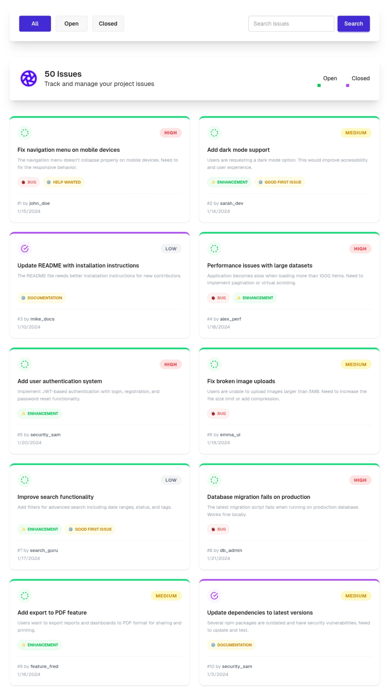

# GitHub Issue Tracker – Assignment 5

A simple web app that mimics a **GitHub issue tracker** interface, built as an assignment to practice HTML, CSS, and basic JavaScript.  

Try it live:  
[https://abrar12678.github.io/assignment---5-Gitub-Issue-Tracker/](https://abrar12678.github.io/assignment---5-Gitub-Issue-Tracker/)

---

## 📷 Screenshots



---

## 🛠️ Tech Stack

- HTML5  
- CSS3 (custom styling)  
- JavaScript (basic interactivity, if any)  
- Responsive layout for desktop and mobile  
- Hosted via GitHub Pages (`https://abrar12678.github.io/...`) 

---

## ✨ Features

- GitHub‑style interface with a list of issues  
- Issue cards containing title, description, status, and metadata  
- Simple filtering or sorting (if implemented, otherwise remove)  
- Responsive layout that works on desktop and small screens  
- Designed for learning and practice (no real GitHub API integration)

---

## 📦 Dependencies

This project uses basic web technologies, so the main “dependencies” are:

- Web browser (Chrome, Firefox, Edge, etc.)  
- An editor (VS Code, Sublime, etc.)  

---

## 🚀 How to Run Locally

1. Clone the repository (update the URL to your real GitHub repo):

   ```bash
   git clone https://github.com/abrar12678/assignment---5-Gitub-Issue-Tracker.git
   ```

2. Go into the project folder:

   ```bash
   cd assignment---5-Gitub-Issue-Tracker
   ```

3. Open the page in your browser:

   - You can simply open `index.html` in the browser, or  
   - Run a simple static server like:

     ```bash
     # Using Python (3.x)
     python -m http.server 8000
     ```

4. Visit in your browser:

   ```text
   http://localhost:8000
   ```

---

## 🌐 Live Link

- Live demo:  
  [https://abrar12678.github.io/assignment---5-Gitub-Issue-Tracker/](https://abrar12678.github.io/assignment---5-Gitub-Issue-Tracker/)

---

## 📚 Notes

- This project is built for **learning purposes and assignment practice**.  
- You can extend it by adding features like:
  - Real issue creation form  
  - Search, filter, or status toggles  
  - Fake “comments” section  
- All styling and layout can be edited in `index.html` and `style.css`.
